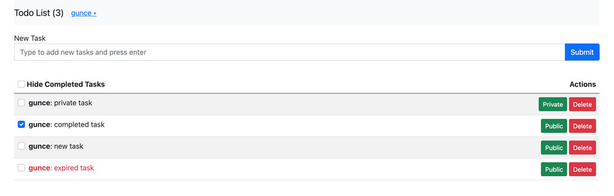

*** This tutorial is still in development

# Complex Todo List App

The Meteor Tutorial app.

Use it to share a single todo list with your friends. The list updates on everyone's screen in real time, and you can
make tasks private if you don't want others to see them.

Learn how to build this app by following the [Meteor Tutorial](http://www.meteor.com/install).

Read more about building apps with Meteor in the [Meteor Guide](http://guide.meteor.com).



### This is doing the same thing with the simple example, but the app is not simple and covers lots of things related with the real world

You can check [Simple Todos Svelte](https://github.com/meteor/simple-todos-svelte) for a basic version. This example is
a little complex (not complicated) to cover some real world topics such as;

[Monolith design](https://github.com/kgrzybek/modular-monolith-with-ddd),
[Schemas](https://www.npmjs.com/package/simpl-schema),
[Validated methods](https://github.com/meteor/validated-method),
[Mixin usage on methods](https://github.com/meteor/validated-method#community-mixins),
[Rate limiting](https://docs.meteor.com/api/methods.html#ddpratelimiter),
[Memcache](https://github.com/node-cache/node-cache),
[Events](https://nodejs.org/docs/latest-v14.x/api/events.html),
[Logging](https://github.com/veliovgroup/Meteor-logger), Migration,
[Jobs](https://github.com/msavin/SteveJobs),
[Unit tests](https://guide.meteor.com/testing.html),
[E2E tests](https://cypress.io/),
[APM](https://montiapm.com/), Deployment etc...

You may find extra comments in some files and readme.md files in some folders. Writing extra comments is evil and do not
do that in your codes, those extra lines are placed to tell you why I choose the approach.

### Why I created the repo?

You may think that learning curve of Meteor.js is simple. I don't agree. I think Meteor.js guide covers lots of topics
and if you stick on the guide, you will have to refactor your code a lot!

I love Meteor.js and know it's power. Because of this, I want to help the community with my limited experience.

### Why you should choose this approach?

I think monolith design helps us to place our code separated and removes strict dependencies. This is a great benefit to
maintain your code base. Do not forget,
"You are not the only developer in the project, your future will read the code". Thus, you should write cleaner for
yourself!

If you find a better approach, please help me to improve this project.

### First Steps

1. If you have time, please read Robert C. Martin's
   book [Clean Code](https://www.amazon.com/Clean-Code-Handbook-Software-Craftsmanship/dp/0132350882)
1. If you don't have you can read the book that is adapted for
   JavaScript [Clean Code JS](https://github.com/ryanmcdermott/clean-code-javascript)
1. After reading those books learn more about building apps with Meteor in the [Meteor Guide](http://guide.meteor.com).
1. Learn [jsdoc](https://jsdoc.app) and use it everytime
1. At last read [cultofcoders](https://github.com/cult-of-coders) [Meteor Tuts](https://www.meteor-tuts.com/). Reading
   this will multiply your programming level.

### Let's Start

1. Install Meteor.js
1. Clone the repo ```git clone https://github.com/guncebektas/complex-todos-svelte.git```
1. cd ```complex-todos-svelte-master```
1. Run ```meteor npm install``` command
1. Run ```npm start``` command
1. Visit ```http://localhost:3000/```

### UI (Svelte & Bootstrap)

I decide to use Svelte & Bootstrap 5. You can use any css framework. We will also write our custom css to style a small
part of the application.

### Packages

I have used many packages for my applications and choose some of them to build this example. You can use them in your
apps or check many others in [npm](https://www.npmjs.com/) or [Atmosphere](https://atmospherejs.com/).

### Using NPM commands

I have edited package.json to run our own commands, including starting meteor
```npm start``` Will run the meteor with settings
```npm test``` Will run the unit tests
```npm run cypress``` Will run cypress tests
```npm visualize``` Will run the visualizer tool on production mode in localhost

## Step by step

1. [Structure](#Structure)
1. [Settings](#Settings)
1. [Schema](#Schema)
1. [Methods](#Methods)
1. [Mixin](#Mixin)
1. [Rate Limit](#RateLimit)
1. [Memcache](#Memcache)
1. [Events](#Events)
1. [Logging](#Logging)
1. [Migration](#Migration)
1. [Jobs](#Jobs)
1. [Tests](#Tests)
1. [APM](#APM)
1. [Deployment](#Deployment)
1. [Quality](#Quality)

### Structure

Meteor.js is very flexible. It's an incredible power of the framework but!
If you don't have enough programming experience or do not structure your code well, You may face with some difficulties
to maintain your code. The monolith design will help us to write modules and guide us to use same approach everywhere in
our app.

#### My rules for the design

##### Main rules

- The entry points should be configured like this in ```package.json```. Client and server folders will prevent wrong
  imports.

```
"mainModule": {
    "client": "client/main.js",
    "server": "server/main.js"
},
```

- Some code should be added to run our application.

```
"scripts": {
    "start": "meteor -s settings.json --port 3000",
    "test": "TEST_WATCH=1 MONGO_URL=mongodb://localhost:27017/ritapos meteor -s settings.json --port 3000 test --driver-package meteortesting:mocha",
    "test-app": "TEST_WATCH=1 meteor test --full-app --driver-package meteortesting:mocha",
    "visualize": "meteor --production --extra-packages bundle-visualizer"
}
```

##### Shared code

Client, Server and Import folder must include a ```shared``` folder. This folder may include shared enums, shared
functions, shared helpers, shared utilities etc... between modules.

##### Modules

A module is the essential part of an application. It's good to separate your modules by collection name. You should keep
a module simple and stupid as much as possible. It might include more than one database if the data is relational, but
it's not recommended.

- A module can be placed in imports or server folder

```
imports
-- modules
server
-- modules
```

- Each module should be in a separated folder in the modules folder
- The application should continue to work without an issue after the removal of a module
- A module must have a plural name (tasks)
- A module must have at least three folders (database, enums, server)
    - Database folder should include schema definitions
    - Enums folder should include all module related statics
    - Server folder should include all server codes
- A module must have repository, methods, service and its own unit tests
    - Repository should extend base repository and include all finds, a repository should know only it's database
    - Methods should be used as validated methods. We can think them as controllers, so they have only one
      responsibility. A controller will take the request and return the result. It will only know the request and
      response, not the logic.
    - Service should include business logic. It will be super if a service knows only its module's data. It's **the
      hardest, and the most important thing** you should pay attention.
- A module may include its own utilities.
- A readme file will be helpful for future you.
- A module must be imported from server side of the application. We will import ```/tasks/server/index.js```
  in ```/server/modules.js```

```
tasks
-- database
---- tasks.js
-- enums
---- cacheKeys.js
---- methodNames.js
---- publications.js
---- rateLimitter.js
-- server
---- index.js
---- tasks.cache.js
---- tasks.ensureIndexes.js
---- tasks.events.js
---- tasks.guards.js
---- tasks.hooks.js
---- tasks.publications.js
---- tasks.rateLimitter.js
-- taskRepository.js
-- tasks.methods.js
-- tasks.methods.test.js
-- taskService.js
-- taskUtility.js
-- readme.md
```

### Settings

Development and production environments and requirements are different. Thus, separated settings are needed. It's very
easy to use different settings with different settings.json. A ```settings.json``` file located in root of the
application will be used for development and another one which is located in .deploy folder will be used for production.

### Schema

Meteor comes with MongoDB. MongoDB is flexible. It's super easy to start a reactive application with MongoDB.  
MongoDB and can keep any kind of data. You can think this as a benefit at first sight. IMO, it's not a great benefit,
and I want to have strict definitions for data. SimpleSchema validates JavaScript objects to ensure they match a schema.
It can also clean the objects to automatically convert types, remove unsupported properties, and add automatic values
such that the object is then more likely to pass validation. Thus, you should learn how to use it. For more information
please [check here](https://www.npmjs.com/package/simpl-schema)

### Methods

Methods are like the controllers of the application. A method can be called from client and server. The client and
server should talk with methods. Client code should not know anything about repositories and services. Client will know
methods and methods will know services. Services may know other services and other repositories.

### Mixins

Every ValidatedMethod can optionally take an array of mixins. A mixin is simply a function that takes the options'
argument from the constructor, and returns a new object of options. You create your own mixins. For
example ```DataOwnerMixin``` is very useful if you want to restrict the actions on the data. You can also
find [community mixins in here](https://github.com/meteor/validated-method#community-mixins)

### RateLimit

By default, DDPRateLimiter is configured with a single rule. This rule limits login attempts, new user creation, and
password resets to 5 attempts every 10 seconds per connection. This default configuration is not covering our
application however every client request should have a rate limiter. Our approach will help us not to forget any of
them. All methods in a module must be defined in ```/moduler/tasks/`servver/tasks.rateLimiter.js```
If we don't define a method in there. The server will not know anything about that method.

### Memcache

Memory caching is an easy way to store frequently used data in memory. IMO, all data about the user can be memorized.
Users are generally a part of an organization so this will reduce the reads from database.

### Events

As I said before separating a module from others is very difficult, events helps us for this separation. Our modules
will talk with each other over events.

### Logging

Logging with different level is essentials to check what is going on during both development and production. An
application log must have at least debug, error, warning, info and success levels. Using debug log may affect
performance so disabling it with a settings file is a good approach.

The [meteor:logging](https://docs.meteor.com/packages/logging.html) package may be included to your project in others packages.
If meteor:logging is solving your needs, you should use meteor:logging package instead of ostrio:logger. 
You should choose packages carefully to prevent new dependencies. 

### Migration

Migration is one of the most important modules in an application. The needs may change during time, or our solutions may
be wrong. In this case, we have to update our code base and reshape our database to change the application behavior. It
will be very easy with a small module which can run migration files with semantic versions.

It's a module in server side. Create a new file in `/server/modules/migrations/server/x.x.x.js` and import it
in ```/server/modules/migrations/server/index.js```. After the next start of the application, the migration will run
automatically for once.

The current version will be stored in a server side collection named as ```_migrations```.

### Jobs

Our application will probably need some jobs which run in a period of time. For example; a report can be generated every
day or tasks may expire after a week. Jobs are great for this kind of works.

### Tests

Writing test is very important on coding. It's not only improving our code quality but also it allows us to move forward
with confidence when changing things or adding new features. A real application will not be static. Users will ask new
features, and we will always refactor old code when we find better approaches.

I will write some unit tests, and e2e test with the help of [cypress](https://www.cypress.io/) to cover some important
steps of the app.

I will share some utilities to make things easier for you and show how to write tests. But, I will not write all the
planned tests :) You can write them and make a pull request.

You can find unit tests in ```/tests/``` and end-to-end tests in ```/cypress/``` folders.

### APM

An app should have a monitoring service. Meteor Galaxy has its own monitoring service, and you can use it without an
additional effort.

If you don't want to use Galaxy, it's really easy to monitor everything with [MontiAPM](https://app.montiapm.com/).
Thanks to [Arunoda](https://github.com/arunoda) and [Zodern](https://github.com/zodern) for this great tool.

### Deployment

There are many options to deploy our app. IMO, it's one of the easiest feature of Meteor. You can deploy your
application with one command. I will choose two of the methods and show you how easy they really are.

#### 1. Deploy to Galaxy

Sign up to [Meteor Cloud](https://cloud.meteor.com/) and deploy to galaxy.
```meteor -s settings.json deploy complex-todos-svelte.meteorapp.com --free --mongo```
The app is ready on [http://complex-todos-svelte.meteorapp.com/](http://complex-todos-svelte.meteorapp.com/)

#### 2. Deploy to Digital Ocean

First, register to [digital ocean](https://m.do.co/c/6e5c35f29036) and create a droplet.
Check [MUP](http://meteor-up.com/) guide and install it. Lastly, edit ```/.deploy/mup.js``` and
write ```npm run deploy``` in to the terminal.

### Quality

Code quality is one of the most important thing a developer have to pay attention. Developers are authors. One person
writes a book, but many will read.

Because of this, you should improve your writing skills. Those tutorials that I recommended are great starting points.

Besides, there are great tools embedded in modern code editors. I recommend WebStorm.

Sonar and Code inspection tools are great to improve your code quality. You may want to disable some rules but please do
not. Let them force you to fix.

## Give a Star

My primary focus for this project is the quality. Creating a good quality product involves a lot of analysis, research
and work. It takes a lot of time. If you like this project, learned something or, you are using it in your applications,
please give it a star ⭐. This is the best motivation for me to continue this work. Thanks!

## Share It

There are very few examples of this type of application. If you think this repository makes a difference and is worth
it, please share it with your friends and on social networks. I will be extremely grateful.
