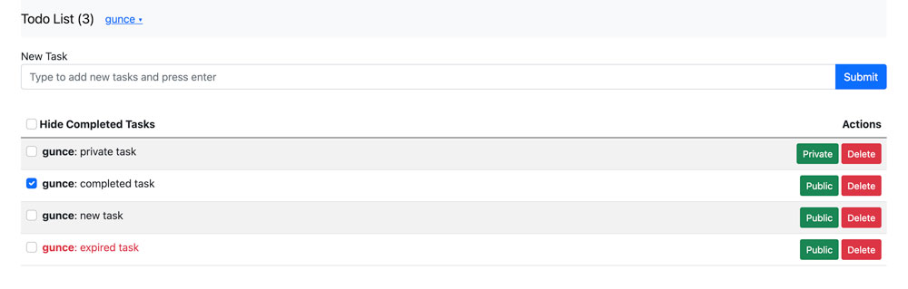

# Complex Todo List App

Same idea as the [simple Svelte tutorial](https://github.com/meteor/meteor3-svelte/tree/3.4-rspack), but not simple. This app covers things you'll actually run into when building something real: module boundaries, validation, rate limiting, caching, migrations, jobs, and proper separation of concerns.

Built with Meteor 3.4, Svelte 5, Skeleton UI, and Tailwind CSS v4.



## Stack

| | |
|---|---|
| Runtime | Meteor 3.4 |
| Frontend | Svelte 5 (runes) |
| UI | Skeleton UI v4 + Tailwind CSS v4, Cerberus theme |
| Build | Rspack |
| Database | MongoDB |
| Validation | Zod + jam:method |
| Caching | node-cache |
| Tests | Mocha (unit), Cypress (E2E) |

## Running it

```bash
meteor npm install
npm start
# http://localhost:3000/
```

Other commands:

| Command | What it does |
|---|---|
| `npm test` | Unit tests (Mocha, watch mode) |
| `npm run e2e` | Open Cypress UI for interactive E2E testing |
| `npm run e2e:headless` | Run E2E tests headless (CI-friendly) |
| `npm run visualize` | Bundle analyzer in production mode |

The app must be running (`npm start`) before you run Cypress.

## How it's structured

The code follows a [modular monolith](https://github.com/kgrzybek/modular-monolith-with-ddd) approach, organized by feature, not by layer. You should be able to delete a module folder and have everything else keep working.

```
imports/modules/tasks/
├── database/tasks.js          # Collection
├── enums/                     # Method names, publication names, rate limits
├── server/                    # Publications, guards, indexes, events
├── taskRepository.js          # Data access (extends BaseRepository)
├── taskService.js             # Business logic
└── tasks.methods.js           # Methods with Zod validation
```

Methods are controllers: they take a request and return a result, nothing more. Services hold the business logic. Repositories talk to the database. If a service needs to notify another module, it fires an event through a shared EventEmitter instead of importing that module directly.

### What's in here

- **Repository pattern**: `BaseRepository` with common CRUD, extended by `TaskRepository`
- **Zod validation**: every method validates its input through `jam:method`
- **Rate limiting**: DDPRateLimiter, 5 req/s per method
- **User caching**: `node-cache` so you're not hitting MongoDB on every user lookup
- **Migrations**: versioned files in `server/modules/migrations/`, run once on startup
- **Scheduled jobs**: tasks expire after 7 days via `Meteor.setInterval()`
- **Events**: cross-module communication through Node's EventEmitter
- **Logging**: level-based (debug, info, warning, error), configurable in `settings.json`

### The UI side

Svelte 5 runes throughout: `$state`, `$derived`, `$props`, no `$:` or `export let` anywhere. A custom `useTracker()` hook bridges Meteor's `Tracker.autorun()` into Svelte writable stores.

The UI uses Skeleton's compound components where they add value (AppBar for navigation, Dialog for the login modal) and plain Tailwind for the rest (task cards, badges, form inputs).

### Rspack config notes

Getting Skeleton UI to work with Rspack required a few tweaks in `rspack.config.js`:

- `fullySpecified: false` because `@zag-js/svelte` uses ESM imports without extensions
- A separate `.svelte.js` loader rule, since these files contain Svelte runes but aren't `.svelte` files
- `onwarn` filter to suppress `state_referenced_locally` warnings from Skeleton's internals

## Settings

`settings.json` in the project root is for development, `npm start` loads it automatically. For production, point your deployment tool at a different settings file.

## Deployment

- **Galaxy**: `meteor deploy your-app.meteorapp.com`
- **Any Node.js host**: `meteor build` gives you a standard Node bundle
- **MUP**: automated deploy to your own server over SSH

For monitoring in production, [MontiAPM](https://montiapm.com/) drops in with minimal config. Galaxy has its own built-in APM.

## Links

- [Meteor docs](https://docs.meteor.com/) · [Meteor guide](https://guide.meteor.com/)
- [Svelte 5 docs](https://svelte.dev/docs)
- [Skeleton UI](https://www.skeleton.dev/) · [Tailwind CSS](https://tailwindcss.com/)
