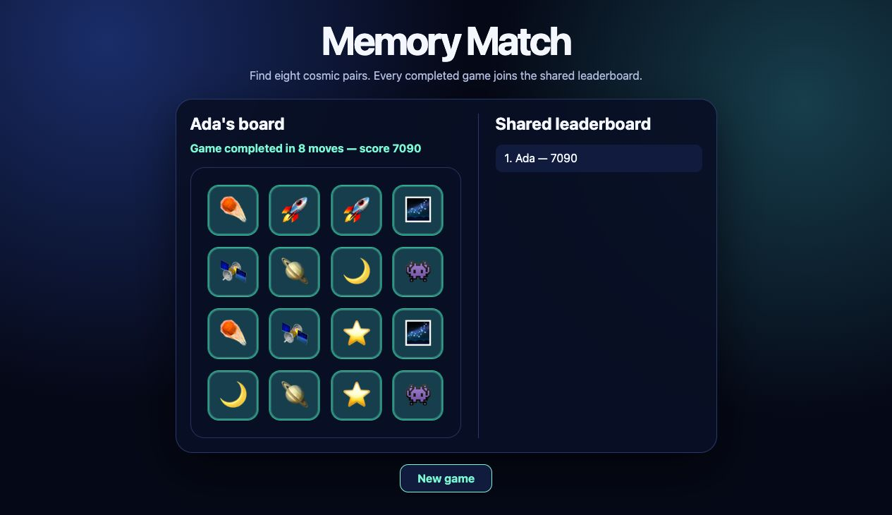

# Memory Match

Small React and TypeScript Meteor app demonstrating Meteor's Rspack/Rstest
integration through direct Meteor CLI commands. Same Memory Match code runs as
native unit tests, jsdom components, Rstest Browser Mode, real Meteor
server/client tests, Atmosphere package tests, and full-app Playwright E2E.

**Experimental checkout example:** this app requires the Meteor source branch
[`rspack-rstest-integration`](https://github.com/meteor/meteor/tree/rspack-rstest-integration).
Setup loads the integration packages directly from that checkout. The examples
repository branch and the Meteor checkout branch are separate.

Play sixteen cards, find eight cosmic pairs, and watch completed scores appear
in a second browser through Meteor's live publication. Start another round with
**New game**. For a presentation, follow the [showcase walkthrough](docs/SHOWCASE.md).



Meteor owns command parsing, Isobuild, Atmosphere compilation, MongoDB, DDP,
application/browser hosts, ports, shutdown, and result aggregation. Rstest owns
native collection plus embedded Meteor-runtime collection, Rspack test
compilation, assertions, fixtures, snapshots, and exit status. Native Rstest
also owns file workers, coverage, Browser Mode, Playwright fixtures, and
reporters.

Unlike a driver package, Rstest participates before Meteor build/runtime
selection. Existing Mocha and Tinytest files stay compatible with their driver
flows. Showcase tests stay beside application features. One Rspack dependency
graph uses direct and transitive imports to select native Node, Browser Mode,
external E2E, or real Meteor hosts. Filename markers handle globals, jsdom, and
explicit server/client ownership. One compatibility-root test remains on
purpose. Meteor runtime tests use real collections, methods, publications,
Minimongo, Tracker, DDP, and MongoDB rather than mocks. Every lane imports its
test API from `@rstest/core`; runtime tests import Meteor modules separately.

## Setup from a Meteor checkout

This showcase declares optional capabilities it uses: jsdom, Browser Mode,
Istanbul coverage, Rstest Playwright, Testing Library, and Playwright. Meteor
integration installs only required Rstest core/Rspack adapter dependencies.

Use Node.js 22.12 or newer and Git. A sibling Meteor checkout is detected by
default:

```text
workspace/
├── meteor/                 # branch: rspack-rstest-integration
└── examples/
    └── memory-match/
```

For a fresh checkout, run this from the directory containing `examples`:

```bash
git clone --branch rspack-rstest-integration https://github.com/meteor/meteor.git meteor
cd examples/memory-match
npm run setup
./meteor-checkout npx playwright install chromium
npm start
```

If Meteor is already elsewhere, select it explicitly:

```bash
cd /path/to/examples/memory-match
METEOR_CHECKOUT=/absolute/path/to/meteor npm run setup
./meteor-checkout npx playwright install chromium
```

From the examples repository root, `npm run setup:memory-match`,
`npm run start:memory-match`, and `npm run test:memory-match` run the same scripts.
On Linux, Playwright may also need system libraries: use
`./meteor-checkout npx playwright install --with-deps chromium`.

Setup validates the branch and checkout packages, creates ignored local package
links, installs dependencies using Meteor's bundled Node/npm, generates
Atmosphere declarations through `zodern:types`, then writes ignored executable
`./meteor-checkout`. The launcher checks the branch on every invocation,
exports checkout-local package paths, and executes checkout Meteor directly.
It does not switch the checkout's branch. To use a compatible development branch,
set `METEOR_RSTEST_BRANCH=your-branch` when running setup.

The two unpublished npm integrations use stable `file:.meteor/local/npm/...`
specs. Run setup before `npm install` or `npm ci` on a fresh clone so those links
exist. `install-links=true` installs package copies whose dependencies resolve
inside this app. Machine-specific paths stay in ignored files.

The current checkout's development config expects React Refresh's older default
export. Setup applies a small compatibility fix to the installed
`@meteorjs/rspack` copy to accept the v2 `ReactRefreshRspackPlugin` export.
The Meteor source checkout is unchanged. This workaround is in
`scripts/checkout.mjs` and can be removed when the integration branch includes
the export fix. Rerun setup after reinstalling npm dependencies.

After setup, `METEOR_CHECKOUT` no longer needs exporting for normal commands.
Checkout wrapper source edits are used directly through internal mirror paths.
Rerun setup after changing checkout location, package contents consumed through
normal app imports, or local package dependency metadata.

The checkout's first run may download its development bundle and Atmosphere
dependencies. No global Meteor installation is needed. Generated builds,
Mongo data, reports, and coverage are ignored. The external recordings project
and local integration design notes are not needed to run this example.

Equivalent direct use:

```bash
./meteor-checkout test --once --server-only \
  --project meteor-pure-server \
  --project showcase-in-source
```

## Run application

```bash
npm start
npm start -- --port 4100
```

Open `http://localhost:3000` (or the selected port). Leave another browser window
on the starting screen to watch the leaderboard update after a completed game.

## Test commands

Every retained script shows complete Meteor command in `package.json`.

| Command | Distinct execution model |
| --- | --- |
| `npm run test:unit` | Native Node unit tests, module mocks, snapshots, and `import.meta.rstest` |
| `npm run test:watch` | Same native projects in watch mode |
| `npm run test:component` | React components in jsdom |
| `npm run test:browser` | Rstest Browser Mode in Chromium |
| `npm run test:integration` | Combined real Meteor server/client runtime |
| `npm run test:package` | Local Atmosphere package harness |
| `npm run test:e2e` | Full Meteor app driven through Rstest Playwright |
| `npm run test:coverage` | One Istanbul report across native, real Meteor server/client, local package, and full-app E2E lanes |
| `npm run test:parallel:native` | Rstest file workers |
| `npm run test:parallel:meteor` | Isolated Meteor server-runtime workers |
| `npm run test:tooling` | Checkout setup and launcher checks without starting Meteor |
| `npm run typecheck` | TypeScript checks after setup generates Meteor declarations |

`npm test` runs same direct command as `test:unit`.

The [GitHub Actions workflow](../.github/workflows/memory-match.yml) checks out
the same Meteor integration branch, runs the test modes sequentially, and saves
coverage and failure artifacts. It also starts the normal development server
and checks its Mongo-backed health endpoint. It runs for changes to this example and can
also be started manually. The experimental Meteor branch can evolve; the npm
lockfile pins this app's external dependencies.

Normal Meteor/Rstest arguments append without wrapper translation:

```bash
npm run test:unit -- --test-name-pattern deck
npm run test:unit -- --test-file imports/game/score.test.ts
npm run test:package -- --server-only
npm run test:package -- --test-name-pattern "package export"
```

Watch mode is activated by omitting `--once`, not by passing unsupported
`--watch` to Rstest:

```bash
npm run test:watch
```

Stop with Ctrl+C.

## How execution is inferred

Folders describe application domains, not runner lanes. Dependency analysis is
the default: Meteor asks Rspack for each test's direct and transitive imports,
then selects the required executor.

| Test kind | Example | Dependency signal | Execution | Command |
| --- | --- | --- | --- | --- |
| Native Node | `imports/game/snapshots.test.ts` | `@rstest/core` | Upstream Rstest in Node | `npm run test:unit` |
| Browser Mode | `imports/ui/MemoryGame.interactions.test.tsx` | `@rstest/browser` | Upstream Rstest in Chromium | `npm run test:browser` |
| Meteor runtime | `imports/api/runtime-context.test.ts` | Direct or transitive `meteor/*` imports | Real Meteor server and browser hosts | `npm run test:integration` |
| External E2E | `tests/e2e/memory-game.test.ts` | `@rstest/playwright` | Playwright against Meteor-owned full app | `npm run test:e2e` |
| Atmosphere package | `packages/memory-match-engine` | `Package.onTest` strongly uses `rstest` | Real `local-test:*` package harness | `npm run test:package` |

Snapshots, coverage, mocking, parameterization, and concurrency are Rstest
features inside these execution types. They do not create separate routing
lanes. For example, `imports/game/snapshots.test.ts` is inferred as native Node
because it imports `@rstest/core`; snapshot assertions then run within that
project.

### Explicit fallbacks

Filename markers stay available when dependency imports cannot express enough
information. They are fallback hints, not default organization:

| Ambiguity | Example | Fallback signal | Result |
| --- | --- | --- | --- |
| Global Rstest APIs provide no import edge | `imports/game/globals.rstest.test.ts` | `.rstest.test` | Native Node ownership |
| `@rstest/core` alone cannot distinguish jsdom from Node | `imports/ui/MemoryGame.dom.rstest.test.tsx` | `.dom.rstest.test` | jsdom project |
| `meteor/*` can run on both architectures | `imports/api/methods.server.meteor.rstest.test.ts` | `.server.meteor.rstest.test` | Server-only Meteor host |
| `meteor/*` can run on both architectures | `imports/ui/App.client.meteor.rstest.test.tsx` | `.client.meteor.rstest.test` | Client-only Meteor host |
| Existing integration layout needs gradual migration | `tests/rstest/pure/server/compatibility.test.ts` | Compatibility root | Native Node project |

In-source tests remain explicit Rstest configuration: `imports/game/shuffle.ts`
uses `import.meta.rstest` and belongs to the `showcase-in-source` project in
`rstest.config.ts`.

Native game tests also cover deterministic shuffle, scoring, hooks,
parameterization, spies, snapshots, module mocking, and concurrency. React
tests cover jsdom and real-browser behavior. Meteor server/client tests cover
methods, publications, MongoDB, DDP, Minimongo, Tracker, package exports, and
isolated runtime workers.

`imports/game/score-mocking.test.ts` uses upstream Rstest `rs.mock` and `rs.fn`;
mock hoisting happens during native Rspack compilation.
`imports/api/methods-spy.server.meteor.rstest.test.ts` uses upstream
`rs.spyOn` only to observe `Games.insertAsync` while real `Meteor.callAsync`,
method code, collection, and MongoDB keep running. Runtime `rs.mock` may replace
app/npm modules in the Rspack graph, but Meteor and Atmosphere modules cannot be
replaced.

## Useful one-off options

Keep flag variations visible instead of adding npm aliases:

```bash
# Update selected snapshots
./meteor-checkout test --once --server-only \
  --project meteor-pure-server \
  --test-file imports/game/snapshots.test.ts \
  --update-snapshots

# Visible Browser Mode or E2E
SHOWCASE_HEADED=1 npm run test:browser
SHOWCASE_HEADED=1 npm run test:e2e

# Detailed test rows without generic Meteor --verbose diagnostics
npm run test:integration -- -- --reporters=verbose

# Native reporter and CI shard
npm run test:unit -- --reporters=verbose
npm run test:unit -- --shard 1/2

# Native Rstest passthrough
npm run test:unit -- -- --retry 2
npm run test:unit -- -- --trace
npm run test:unit -- -- --detectAsyncLeaks
```

`npm run test:coverage` is one `--once --coverage --full-app` selection. It
keeps the tests' ordinary `@rstest/core` and `@rstest/playwright` imports, while
collecting native tests, real Meteor server/client runtime tests, the loaded
local `memory-match-engine` package, and Rstest Playwright fixture pages into
one Istanbul report. The coverage include list deliberately contains the
package source root, so the report contains the physical
`packages/memory-match-engine/engine.ts` path as well as app sources. Meteor,
MongoDB, DDP, Atmosphere packages, and browser hosts remain real; no Meteor
mocks are introduced.

Coverage writes `coverage/index.html` and
`coverage/coverage-summary.json`. Failure screenshots go under
`reports/failures`; E2E traces are retained on failure. Native-only selections
may use upstream Istanbul or V8 coverage, but any selection containing Meteor
uses Istanbul. Meteor watch generations are not aggregated; included sources
that no selected host loads do not get zero-hit entries; and custom-compiler
package sources are not covered. Standard local `ecmascript` and `typescript`
packages are supported.

## Parallelism

`test:parallel:native` forwards
`--pool.type threads --pool.maxWorkers 4` to native Rstest. One coordinator
runs test files across Node workers; no extra Meteor host starts. Inside each
file, `test.concurrent` and `describe.concurrent` use `maxConcurrency: 2` from
`rstest.config.ts`; explicit `.sequential` cases form ordering barriers.

`test:parallel:meteor` passes `--runtime-workers 2` to Meteor. Meteor
partitions server runtime files across isolated hosts with separate local build
directories, ports, Mongo databases, and aggregated results. Within each host,
Meteor-runtime `.concurrent` cases use same bounded scheduler and share that
host's Meteor process and Mongo database.

These are separate scheduling layers. CI sharding remains an ordinary
`--shard index/count` option rather than another project script.

Run same-file concurrency examples directly:

```bash
npm run test:unit -- \
  --test-file imports/game/concurrency.test.ts \
  -- --reporters=verbose

./meteor-checkout test --once --server-only \
  --project meteor-runtime-server \
  --test-file imports/api/concurrency.server.meteor.rstest.test.ts \
  -- --reporters=verbose
```

## Configuration boundaries

`rstest.config.ts` uses `defineConfig` from `@meteorjs/rstest`. Dynamic
Meteor context supplies roots, sides, lifecycle phase, and protected generated
projects with exact import-inferred file manifests. App config adds shared
setup, timeouts, Browser Mode, coverage, in-source project, and app-specific
Rspack adjustments. Shared setup stays environment-neutral because it loads in
native and Meteor-runtime lanes.

`rspack.config.ts` uses `defineConfig` from `@meteorjs/rspack` and adds
only application behavior. Meteor aliases, externals, entries, lifecycle
plugins, and Atmosphere package handling stay integration-owned.

Optional npm capabilities remain project-owned. E2E imports
`@rstest/playwright` directly while Meteor supplies managed application URL
and lifecycle.
